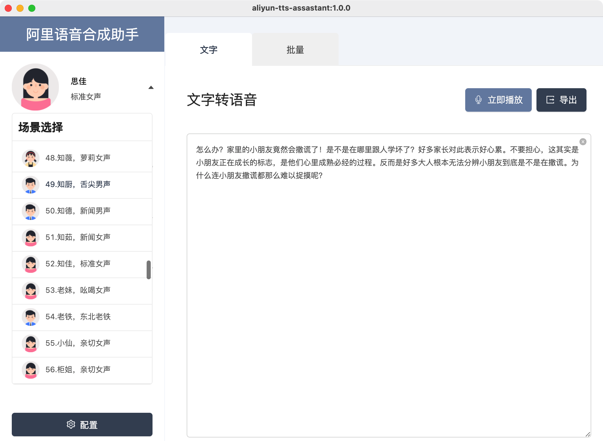
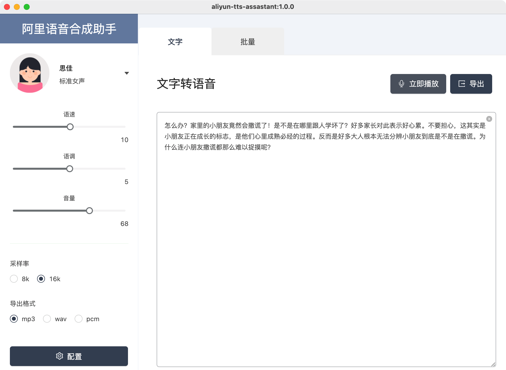
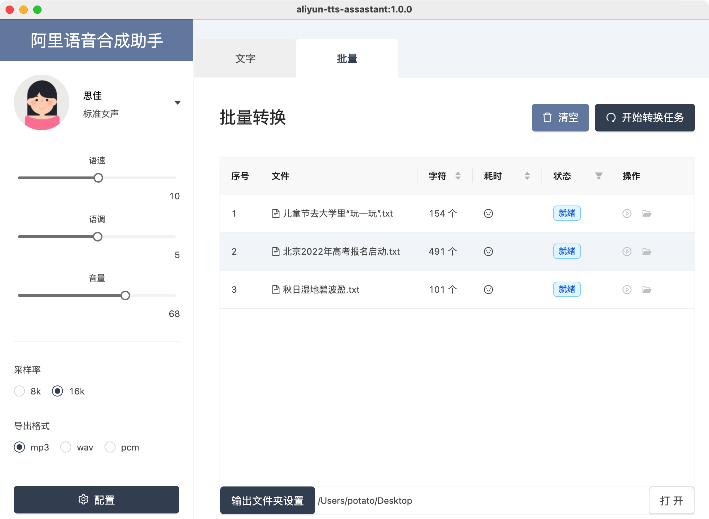
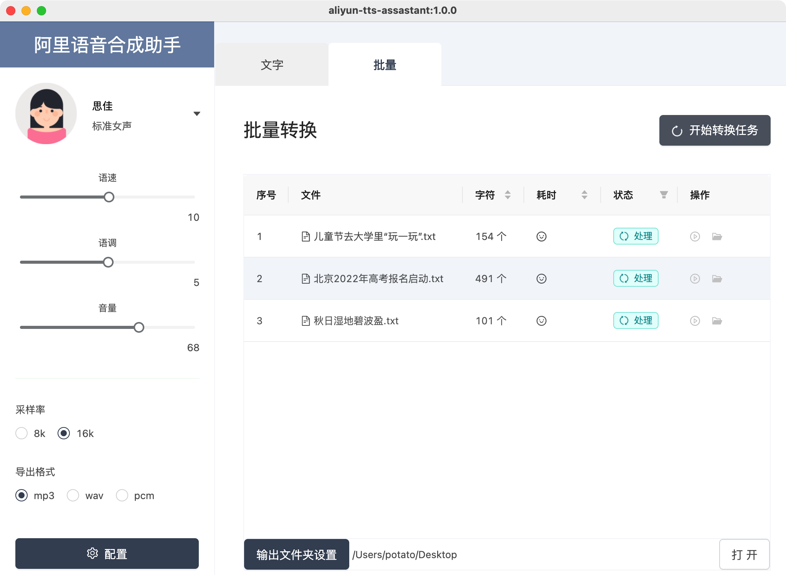
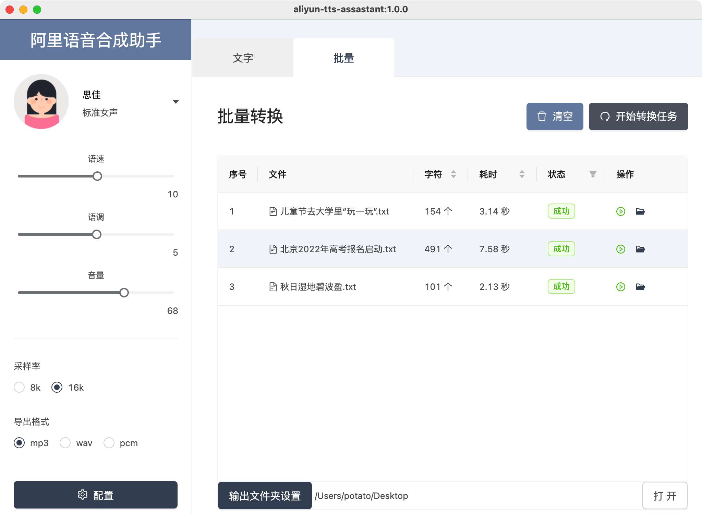

# TTS Asstants Base AliYun

## 说明

基于阿里云语音合成 API 的语音合成助手。支持 99 种场景语音合成，可以单文本快速预览和批量语音合成。

备注：此工具依赖阿里云语音合成 API，使用时需要到阿里云创建语音合成 AppKey，以及阿里云账号 API Key。点这里=>直达注册](https://ai.aliyun.com/nls/tts)。

## 环境

应用基于 React Typescript Webpack 构建。
使用的 Node 的构建版本为 **^14.17.5**，为避免冲突，建议使用此版本。可以使用 **_nvm_** 管理 Node 版本。

主要依赖库版本：

- electron: ^15.3.0
- electron-builder: ^22.13.15
- eslint: ^7.32.0
- babel: ^7.15.8
- css-loader: ^6.4.0
- less: ^4.1.2
- sass: ^6.0.1
- typescript: ^4.4.4
- webpack: ^5.59.1
- prettier: 2.4.1

### UI/组件：

- antd
- @ant-design/icons
- normalize.css

## 目录

- `app.config.js`: app 基础配置
- `electron.builder.js`: 打包配置
- `public`：静态资源文件夹
- `config`：webpack 打包配置
- `src/background.ts`：electron main ，code here

## 命令

执行：`yarn install` or `npm install`，然后：

- 开发服务启动：`npm run serve`
- Lint 格式化：`npm run lint`
- 源构建输出：`npm run dist`
- 根据当前系统构建：`npm run build`
- 基于 dist 输出，根据当前系统构建：`npm run build:now`
- 构建 Windows 二进制：`npm run build:windows`
- 构建 Mac 二进制：`npm run build:mac`
- 构建 Linux 二进制：`npm run build:linux`

## 打包

- 源构建输出：`./build/bundle`
- 打包输出目录：`./build/binary`

## 其他

此工具 [基于 typescript 和 React 的 Electron 脚手架应用](https://github.com/funnyzak/electron-react-quick-start) 构建。

## 预览

以下为 App 实际运行展示：

### 语音场景选择（99 种）

### 单文本快速合成

### 批量合成

## 参考

- [Electron](https://electronjs.org/docs)
- [Babel Config](https://babel.docschina.org/docs/en/7.0.0/configuration/)
- [EsLint](https://eslint.org/docs/user-guide/configuring/)
- [eslintignore-file](https://eslint.org/docs/user-guide/configuring/ignoring-code#the-eslintignore-file)
- [TSconfig](https://www.typescriptlang.org/tsconfig/)
- [npmrc](https://docs.npmjs.com/cli/v7/configuring-npm/npmrc)
- [gitignore](https://git-scm.com/docs/gitignore)
- [webpack](https://webpack.docschina.org/guides/getting-started/)
- [prettier](https://prettier.io/docs/en/index.html)

## License

MIT License © 2021 [funnyzak](https://github.com/funnyzak)
