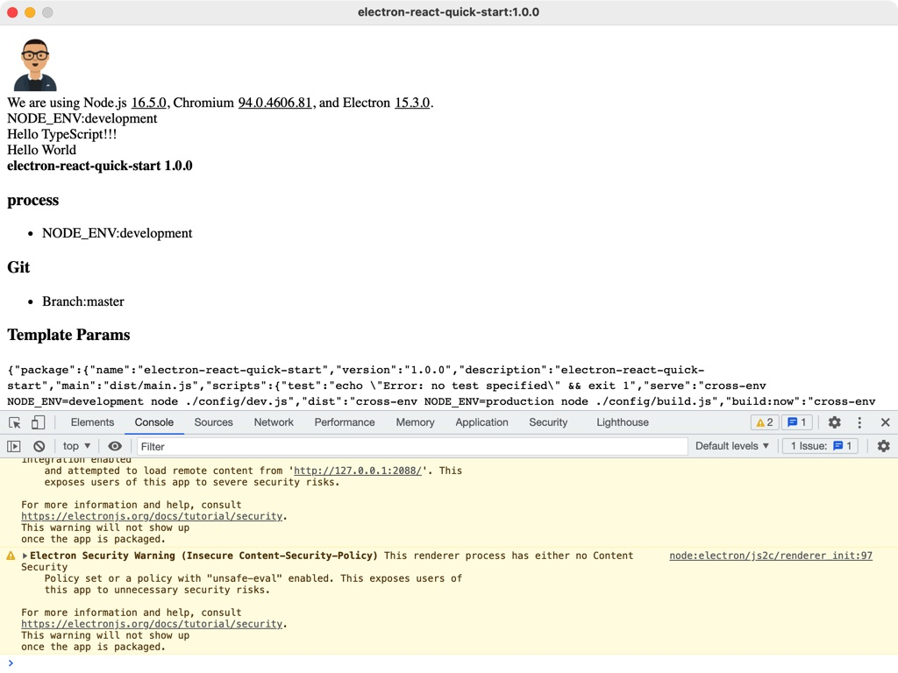

# Electron React Quick Start

## 说明

基于 React Typescript Webpack 构建 Electron 应用脚手架。

- babel 转换支持
- typescript 支持
- react 支持
- sass 支持
- less 支持
- hbs 文件 模板支持
- png|svg|jpg|jpeg|gif 引入支持
- git commit hooks, no 💩

### 运行

## 环境

使用的 Node 的构建版本为 **^14.17.5**，为避免冲突，建议使用此版本。可以使用 **_nvm_** 管理 Node 版本。

主要依赖库版本：

- electron: ^15.3.0
- electron-builder: ^22.13.15
- eslint: ^7.32.0
- babel: ^7.15.8
- css-loader: ^6.4.0
- less: ^4.1.2
- sass: ^6.0.1
- typescript: ^4.4.4
- webpack: ^5.59.1
- prettier: 2.4.1

## 目录

- `public`：静态资源文件夹
- `config`：webpack 打包配置
- `config/index.js`: 常用配置, edit here
- `src/background.ts`：electron main ，code here

## 使用

执行：`yarn install` or `npm install`，然后：

- 开发服务启动：`npm run serve`
- Lint 格式化：`npm run lint`
- 源构建输出：`npm run dist`
- 根据当前系统构建：`npm run build`
- 基于 dist 输出，根据当前系统构建：`npm run build:now`
- 构建 Windows 二进制：`npm run build:windows`
- 构建 Mac 二进制：`npm run build:mac`
- 构建 Linux 二进制：`npm run build:mac`

## 打包

- 源构建输出：`./dist`
- 打包输出目录：`./build`

## 其他

点击这里访问 [基于 typescript 和 webapck 的 React 脚手架应用](https://github.com/funnyzak/react-typescript-quick-start)。

## 参考

- [Electron](https://electronjs.org/docs)
- [Babel Config](https://babel.docschina.org/docs/en/7.0.0/configuration/)
- [EsLint](https://eslint.org/docs/user-guide/configuring/)
- [eslintignore-file](https://eslint.org/docs/user-guide/configuring/ignoring-code#the-eslintignore-file)
- [TSconfig](https://www.typescriptlang.org/tsconfig/)
- [npmrc](https://docs.npmjs.com/cli/v7/configuring-npm/npmrc)
- [gitignore](https://git-scm.com/docs/gitignore)
- [webpack](https://webpack.docschina.org/guides/getting-started/)
- [prettier](https://prettier.io/docs/en/index.html)

## License

MIT License © 2021 [funnyzak](https://github.com/funnyzak)
